# Decision Making of Movie Release Date

## Introduction
A mathematical model for the decision making of movie release date. 

Visualizations of movie data have also been done to provide a better cooperation between human decision and machine decision. 

## Problem Analysis
### Influence Factors
The decision making of movie release date is a multifaceted problem. Factors that impact the decision making process can be decomposed to 
- Historical Box Office Receipts
- Competitors
- Performance of movies in same genre
- Franchise
- Budget

Other factors like casting, director and studio can also be effective variables, but they are not considered at the moment.

### Features in human decisions

- High release density in holidays
- Off-peak release (avoid strong competitors)
- Release on Friday (Disney usually release movie on Friday)
- imitate high performance movie in same genre

The model needs to consider all these factors comprehensively to give a convincing result. AHP has been used here to construct the model, while the RCP included in this process can be used to calculate the weight vector for the final Weighted Sum Model.

### Problems to solve

- collect data that covers long time period and movie variety
- produce qualitative assessment
- turn qualitative data to quantitative data
- combine factors to compare dates in proposed time period

## Analytical Hierarchy Process

### Analytic Hierarchy Model
There are 5 factors impact the goal, which is finding the best date to release a movie, so M = 5. And there could be N choices of date (every Friday in the chosen time period). So the AHM can be constructed as a M * N matrix, where M is the number of criteria, and N is the number of alternatives.

### Linear Scale
Several simple linear scale were designed to quantify each factor. (see algoMerge/algoMerge.py)

##### Factor 1 - History Box Office

V in the select set is the predicted box office of each day, week, and month respectively based on history box office data.

The contribution of the predicted daily, weekly and monthly box office will be counted evenly to factor 1, and factor 1 will contribute to the final result.
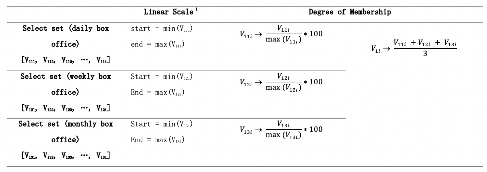

##### Factor 2 - Competitor

V in the select set is the number of all competitors and same genre competitors on the same day.
The contribution of the two factor to factor 2 are counted evenly.
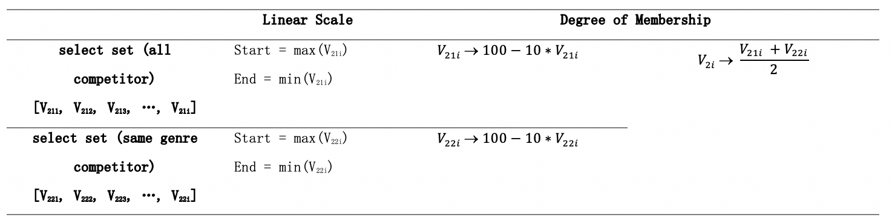

##### Factor 3 - Genre

V in the select set = sum(weekly historical box office of a specific genre in past 10 years)
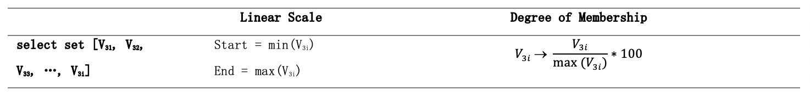

##### Factor 4 - franchise

Here we filter weeks that has movie with certain franchise released, then we can get week set T.
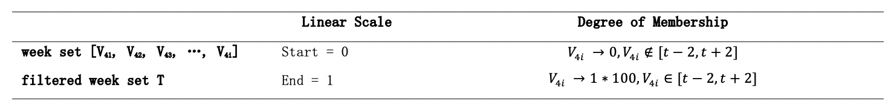

##### Factor 5 - movie budget

Here we filter weeks that has movie budgeted over 2 million in past 10 years, then we can get week set T.

Also, we assigned degree of membership to adjacent weeks to some extent.
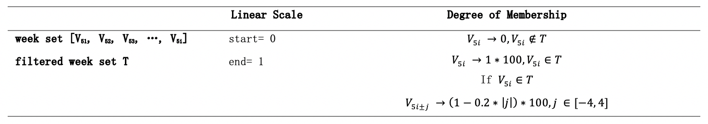

### Real Continuous Pairwise Comparison
RCP method was adopted here to calculate the weight of 5 factors. Saaty’s 1-9 Scale of Pairwise Comparisons was used to compare the importance between each two factors to build the RCP matrix. 
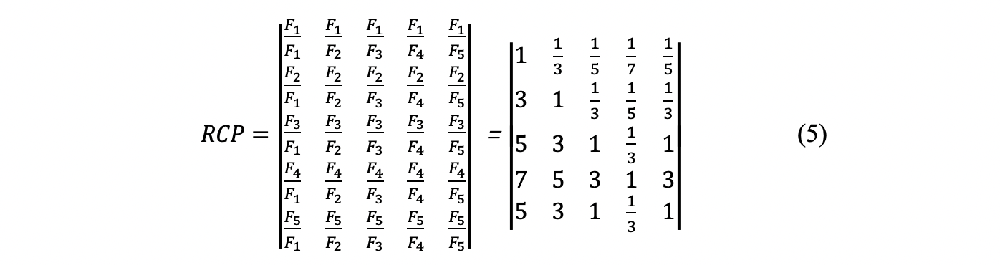

After the 5*5 matrix was built, there was consistency checking needed to make sure that the largest eigenvalues and corresponding eigenvectors of the matrix are effective to be set as weight of factors.
Here we use

 CR = CI/RI 
 

to do the consistency checking. CI = (λ-n)/(n-1), λ is the largest eigenvalue of the built 5 * 5 matrix, while RI, the Random Consistency Index, equals 1.12 when index = 5.

The consistency checking can be passed if CR < 0.1 . Otherwise the RCP matrix need to be rebuilt until it passes the consistency checking. Then we could use the normalized eigenvector corresponding to the largest eigenvalue as the weight vector for the Weighted Sum Model.

Here we used linalg.eig() in numpy to do the calculate. The results are 

- largest eigenvalue = 5.1268911
- corresponding eigenvectors of the matrix = [0.0426, 0.0862, 0.2009, 0.4690, 0.2009]
- CR = 0.0283 

which passed the consistency checking.

## Process Data
### Collect
Up to 90% of data in database was collected from BoxOfficeMojo, and the python scrapy file can be found in dataCollect/collect_boxOfficeMojo.py. Manual collecting was also adopted since a little part of data was missing.
### Clean
Data collected at the first stage was not consistent enough to be put into formulas executing calculation. So different data cleaning method was executed for each collection to transfer date to week number, stirng to number, thousand to million, etc.
### Quantify
The model uses different linear scale for each factor to quantify irregular data to calculable numbers.
##### Predict box office
Factor 1 will be quantified based on the predicted box office results. There are 7 kinds of methods which are 
- [M1]simple average
- [M2]weighted moving average I
- [M3]weighted moving average II
- [M4]auto-regressive model
- [M5]moving average model
- [M6]auto-regressive moving average model
- [M7]differential integrated moving average auto-regressive model

to conduct prediction. For each daily, weekly, and monthly box office prediction, these methods are compared and chosen based on the mean deviation.

And there are 3*3 kinds of data set used, which are box office on 

- [D1]date/week/month to be predicted in 2008, 2009, 2010, ..., 2017;
- [D2]Jan 01, 2018 - date/week/month to be predicted;
- [D3]Jan 01, 2008 - date/week/month to be predicted

By combining each prediction method and data set, then the optimal method and data set could be chosen. The results are

- daily prediction: M1 + D1;
- weekly prediction: M3 + D1;
- monthly prediction: M5 + D1

### Merge
Use the weight vector which has been calculated by RCP matrix as the weight vector for all the factors. Then we have the final grading of all alternatives(all Fridays in the given time period)

Here are some testing results.
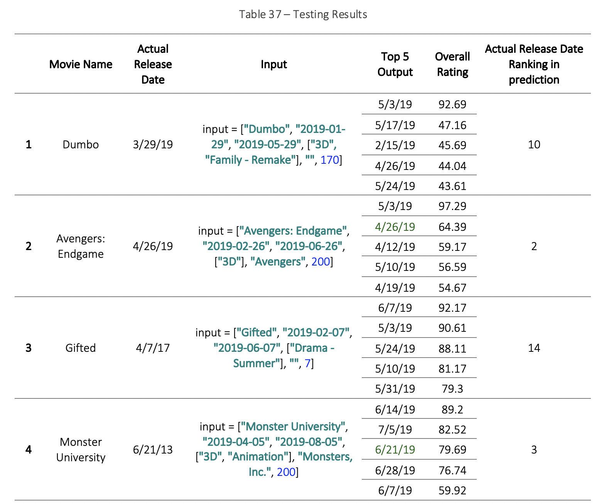
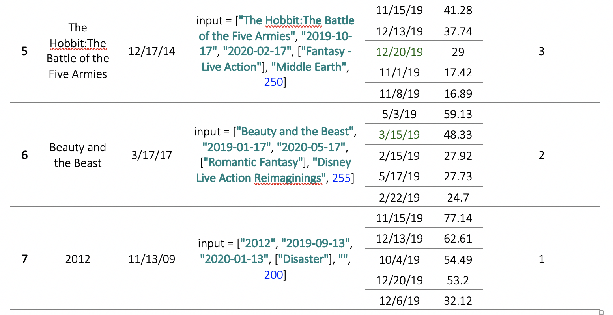

It can be found from test results that for movies with obvious characteristics (themes, movie series) or high budget movies, the results given by the model are in good agreement with the actual movie release dates, and for low budget or less featured movies, the result could be significantly different from the actual release date. The reason might be data insufficiency for such movies, making the output dependent on the remaining two factors which are historical movie box office and competitors.

It should also be noted that the actual release dates which are used for comparison cannot be determined to be the best release date. Even if the test output does not match the actual date, it still consists reference value since it is supported by historical data.
## User Interface
### Input Field
- movie name
- start date & end date
- movie genres
- franchise (optional)
- production budget
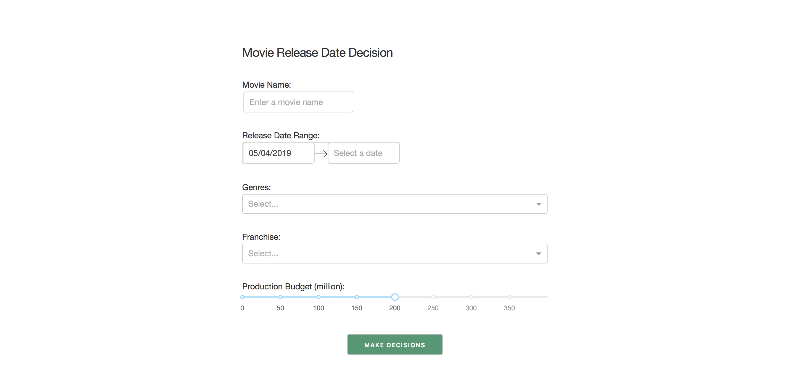

### Output
- grading table of final results and each factor in descending order
- grading heat map of final results and each factor

### Data Charts
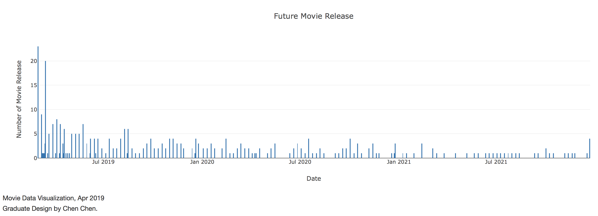
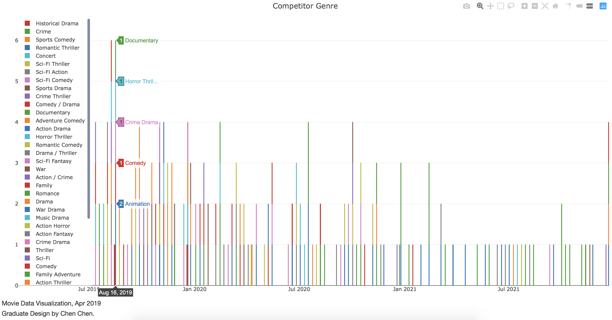
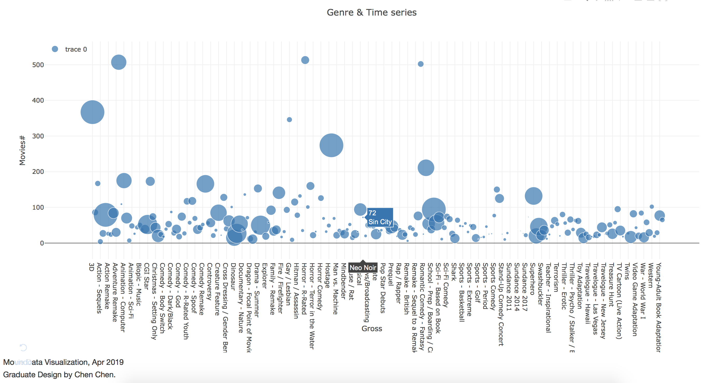
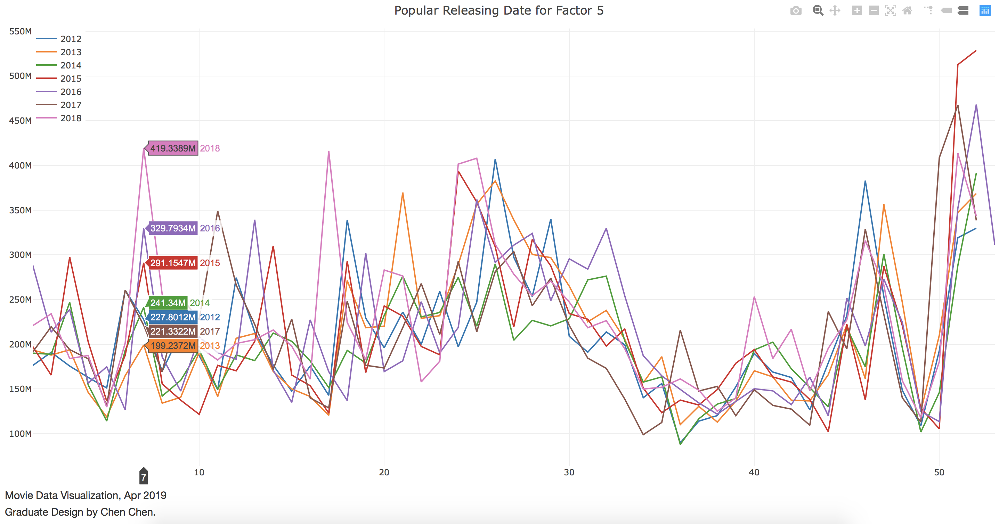

## Installation
### Dependencies
- dash
- pymongo
- pyquery
- numpy
- statsmodels
### Database
Install mongodb in local environment, use 'movie_db' as the database name and import all the json files in json directory as collections.

## References
[1] Saptarshi Sasmal, K. Ramanjaneyulu and Nagesh R. Iyer, “Condition Ranking and Rating of Bridges Using Fuzzy Logic”, March, 2012.

[2] Ben-Arieh, D. & Triantaphyllou, E. (1992). Quantifying data for group technology with weighted fuzzy features, Int. J. of Production Research, Vol. 30, pp. 1285-1299. 

[3] Bridgman, P. W. (1922). Dimensional analysis. New Haven, CT: Yale University Press.

[4] Saaty, T.L. (1994). Fundamentals of decision making and priority theory with the AHP, RWS 
Publications, Pittsburgh.

[5] Nihar B. Shah, Martin J (2018). Wainwright. Simple, Robust and Optimal Ranking from Pairwise Comparisons, Journal of Machine Learning Research 18 (2018) 1-38